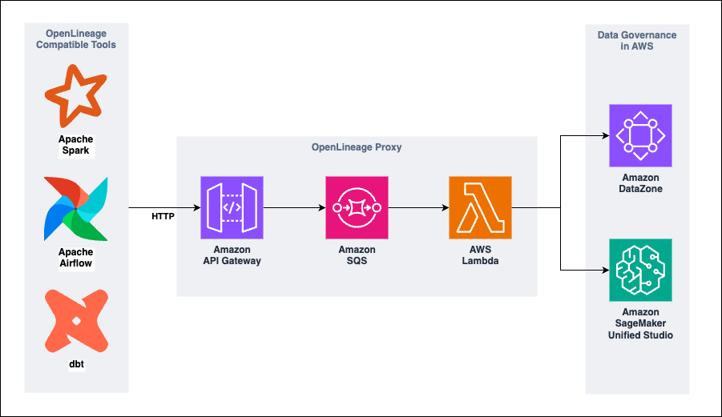

# AWS Sample - OpenLineage HTTP Proxy for Amazon SageMaker Governance and Amazon DataZone

## Table of Content

1. [Overview](#overview)
2. [Prerequisites](#prerequisites)
3. [Deployment Steps](#deployment-steps)
4. [Cleanup](#cleanup)
5. [Additional considerations](#additional-considerations)
6. [Notices](#notices)
7. [Security](#security)
8. [License](#license)
9. [Authors](#authors)

## Overview

### What problem does this solution solve?

The following sample solution was built as a guidance for customers who want to learn how to integrate lineage of [third-party data processing tools](https://openlineage.io/docs/integrations/about) supporting the OpenLineage standard, like Apache Airflow, Apache Spark and DBT, with Amazon SageMaker Governance and Amazon DataZone. With this capability, customers are one step closer to centralize governance of all their data pipelines and data assets in a single place.

They way that it works is simple, as it leverages the HTTP transport option that all OpenLineage integrations support. As shown in the diagram bellow, by leveraging AWS serverless services like Amazon API Gateway, Amazon Simple Queue Service (Amazon SQS) and AWS Lambda the solution puts together a proxy with a HTTP endpoint that receives an incoming stream of OpenLineage events, queues them and processes them in small batches before posting them into an Amazon SageMaker Governance or Amazon DataZone domain.



Once the solution is deployed, you can set up the OpenLineage transport configuration of your data processing tool to point to the Amazon API Gateway endpoint using the HTTP protocol so that the proxy is able to post your events into your Amazon SageMaker Governance or Amazon DataZone domain seamlessly. In addition you can add transformation logic to the AWS Lambda function processing the batch of events for complex scenarios if needed.

### What AWS Services does this solution use?

- [Amazon API Gateway](https://aws.amazon.com/api-gateway/)
- [Amazon Simple Queue Service](https://aws.amazon.com/sqs/)
- [AWS Lambda](https://aws.amazon.com/lambda/)
- [Amazon CloudWatch](https://aws.amazon.com/cloudwatch/)

### Cost

All services used by the solution are serverless which means that costs will fully depend on your workload and how much OpenLineage events are being sent into the proxy. To optimize for costs, the AWS Lambda function in the solution processes OpenLineage events by batches of 20 events or after waiting 5 seconds (whatever comes first). This behavior can be modified as needed.

## Prerequisites

### Supported Regions

Please check for supported regions for Amazon SageMaker Unified Studio and Amazon DataZone in the following [link](https://aws.amazon.com/about-aws/global-infrastructure/regional-product-services/). This guidance has been tested in *us-east-1* and *us-west-2* regions.

### Setup the AWS CLI

To deploy this solution you'll be using the AWS CLI to upload some assets to an Amazon S3 bucket in your AWS account. To achieve this, you need to setup an AWS CLI profile in your machine to be able to interact programmatically with your AWS environment. For more details on how to set this up, please review the [AWS documentation](https://docs.aws.amazon.com/cli/latest/userguide/cli-configure-files.html).

### Create an Amazon S3 Bucket

To deploy this solution, you'll first upload some assets to an Amazon S3 bucket in your AWS account. It is recommended to use a new bucket for tis instead of an existing one as you test the solution. For more details on how to create you bucket, please follow the following [AWS documentation](https://docs.aws.amazon.com/AmazonS3/latest/userguide/GetStartedWithS3.html#creating-bucket).

You can also create your bucket using the AWS CLI. To learn more, please refer to the following [AWS CLI documentation](https://docs.aws.amazon.com/cli/latest/reference/s3api/create-bucket.html).

## Deployment Steps

### Clone the repository and upload assets to your Amazon S3 bucket

In a terminal window of your local machine, clone the solution's GitHub repository in your preferred working directory and move to the solution's root folder.

```sh
git clone https://github.com/aws-samples/sample-openlineage-proxy-for-amazon-sagemaker-governance
cd sample-openlineage-proxy-for-amazon-sagemaker-governance
```

The *sync_assets.sh* file in the root directory provides a simple script to copy assets in the solution's folder into your Amazon S3 bucket. These assets will e used for the solution's deployment. 

To run the script, in your terminal, execute the following command while standing in the solution's root directory: 

**Note:** Replace `<BUCKET_NAME>` with the name of the Amazon S3 bucket where you want to upload the assets and `<AWS_CLI_PROFILE_NAME>` with the name of the AWS CLI profile name that points to your AWS account. If you didn't se a custom AWS CLI profile name, replace `<AWS_CLI_PROFILE_NAME>` with `default`.

```sh
sh sync_assets.sh -b <BUCKET_NAME> -p <AWS_CLI_PROFILE_NAME>
```

You'll notice that the command will sync assets successfully from the solution's folder into your Amazon S3 bucket. 

### Deploy the Amazon CloudFormation stack of the solution

To deploy the solution in your AWS account we will leverage Amazon CloudFormation. Head to the [Amazon CloudFormation console](https://console.aws.amazon.com/cloudformation) and follow these steps:

- In the right side corner, click the **Create stack** dropdown button, then click the **With new resources (standard)** option. A form will display to setup the deployment of the Amazon CloudFormation stack.

- In the **Create stack** section, in the **Specify template** sub-section, under the **Amazon S3 URL** option in the **Amazon S3 URL** field use the value `https://<BUCKET_NAME>.s3.<REGION>.amazonaws.com/lineage-proxy/stacks/openlineage-proxy.yaml` which is the S3 URL of the Amazon CloudFormation template that was uploaded to your Amazon S3 bucket in the last step. 

  **Note:** Please replace `<BUCKET_NAME>` and `<REGION>` tags with the right values that point to the Amazon S3 Bucket in your environment. You can also use the [Amazon S3 console](https://console.aws.amazon.com/s3) to navigate to the `lineage-proxy/stacks/openlineage-proxy.yaml` file and get the complete S3 URL from its metadata.

  Click **Next**.

- In the **Specify stack details** section fill the fields with the following values:
  
   - For **Stack name** use `open-lineage-proxy`. You can alternatively use a different name.
   - For **DomainId** use the Amazon SageMaker Studio or Amazon DataZone domain id. It should follow the pattern `dzd_xxxxxxxxxxx`.
   - For **DomainName** use the name that you used for your Amazon SageMaker Studio or Amazon DataZone domain. Use lowercase characters and digits only.
   - For **S3AssetsBucketName** us the name of the Amazon S3 bucket that you used to upload the solution's asset.
   - Click **Next**.

- In the **Configure stack options** section, check the **I acknowledge that AWS CloudFormation might create IAM resources with custom names** checkbox and click **Next**.

  **Note:** For this solution the only Amazon IAM role that are deployed are those assumed by the Amazon API Gateway and the AWS Lambda function. Both roles include minimum permissions following security best practices.

- In the **Review and create** section, review everything and click **Submit**. Deployment will start.

- After a couple of seconds the solution should have deployed successfully. 

Now everything is in place to start using the solution.

## Cleanup

To cleanup your environment follow these steps:

- Head to the [Amazon CloudFormation console](https://console.aws.amazon.com/cloudformation).
- Select the solution stack that you deployed. If following the steps in the deploy section, it should be named `open-lineage-proxy`.
- In the top right corner, click the **Delete** button. A confirmation pop-up window will show. Click **Delete**.
- Stack deletion will start and after a couple of seconds would have deleted all resources successfully.
- Finally, clean you Amazon S3 bucket. Delete the assets that were uploaded under the `lineage-proxy/` path. If you created a new bucket for the deployment of this solution, delete the bucket too. 

  For more details in deleting objects from your bucket and the bucket itself please refer to the following [AWS documentation](https://docs.aws.amazon.com/AmazonS3/latest/userguide/GetStartedWithS3.html#deleting-object-bucket).

Now your environment is clean from resources associated to this solution.

## Additional considerations

This solution is not intended to be used in production environments, but to serve as a guidance for customers on how to implement similar patterns that integrate their OpenLineage compatible tools with Amazon SageMaker Governance and Amazon DataZone.

If you intend to use this solution as a baseline to implement your ultimate solution, consider the following:

- The Amazon API gateway under the solution's implementation is public. For production environments we suggest private endpoints to secure its usage.
- The Amazon SQS queue is standard. For easier debugging and troubleshooting you may consider experimenting with first-in-first-out (FIFO) queues to preserve the order of lineage events.
- The transformation logic in the AWS Lambda function will post all incoming events into your domain target (regardless its origin) and only perform minor updates to events sent by Apache Airflow when running on top of Amazon Redshift. This logic can be extended or fully modified to suit your specific needs.

For any feedback, questions, or suggestions, please use the issues tab under this repo.

## Notices

Customers are responsible for making their own independent assessment of this solution. This solution: (a) is for informational purposes only, (b) represents AWS current product offerings and practices, which are subject to change without notice, and (c) does not create any commitments or assurances from AWS and its affiliates, suppliers or licensors. AWS products or services are provided “as is” without warranties, representations, or conditions of any kind, whether express or implied. AWS responsibilities and liabilities to its customers are controlled by AWS agreements, and this Guidance is not part of, nor does it modify, any agreement between AWS and its customers.

## Security

See [CONTRIBUTING](CONTRIBUTING.md#security-issue-notifications) for more information.

## License

This library is licensed under the MIT-0 License. See the LICENSE file.

## Authors

Jose Romero
